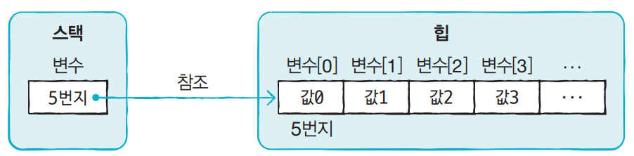
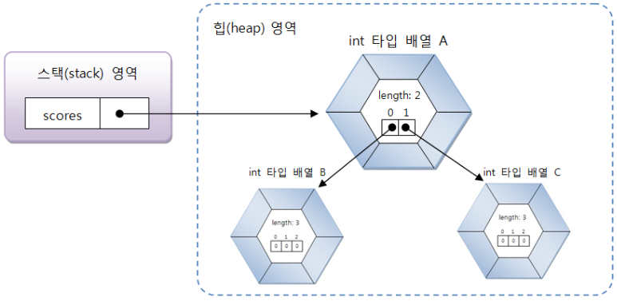
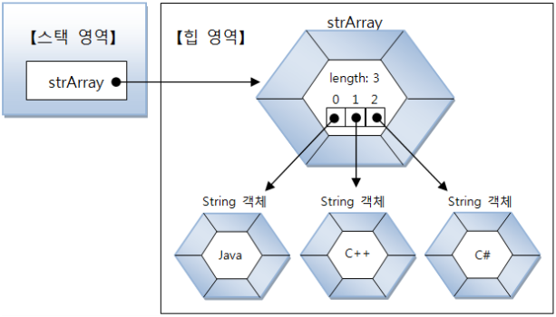

# 배열
### 배열 선언

    1) 타입[ ] 변수;
    2) 타입 변수 [ ];

대괄호 [] 는 배열 변수는 선언하는 기호로 사용되는데, 타입 뒤에 붙을 수도 있고 변수 뒤에 붙을 수도 있다. 타입은 배열에 저장될 데이터의 타입을 말한다.

```java
int[] intArray;
double[] doubleArray;```

```java
int intArray[];
double doubleArray[];
```

배열 변수는 참조 변수에 속한다. 배열도 객체이므로 힙 영역에 생성되고 배열 변수는 힙 영역의 배열 객체를 참조하게 된다. 참조할 배열 객체가 없다면 배열 변수는 null값으로 초기화될 수 있다.

    타입[] 변수 = null;  
- 이때, 만약 배열 변수가 null값을 가진 상태에서 값을 읽거나 저장하게 되면 NullPointerException이 발생한다.

### 값 목록으로 배열 생성

    데이터타입[] 변수 = {값0, 값1, 값2, ...};



- 값의 목록으로 배열 객체를 생성할 때 주의할 점
> 배열 변수를 이미 선언한 후에 다른 실행문에서 중괄호를 사용한 배열 생성을 허용되지 않는다. 

    타입[] 변수;
    변수 = {값0, 값1, ...} //컴파일 에러

배열 변수를 미리 선언한 후, 값 목록들이 나중에 결정된다면 new 연산자를 사용해서 값 목록을 지정해주면 된다.

    변수 = new 타입[] {값0, 값1, 값2, ... };

```java
String[] names = null;
names = new String[] {"신용권", "홍길동", "감"};
```

### new 연산자로 배열 생성
값의 목록을 가지고 있지 않지만, 향후 값들을 저장할 배열을 미리 만들고 싶다면 new 연산자로 배열 객체를 생성시킬 수 있다.

    타입[] 변수 = new 타입[길이];

```java
int[] intArray = new int[5];
```
만약 String 배열을 생성했다면 names[0]에서 names[29]까지 모두 null 값으로 초기화된다.

  
## 다차원 배열
```java
int[][] scores = new int[2][3];
```
이 코드는 세 개의 배열 객체를 생성한다.

배열 변수인 scores는 길이 2인 배열 A를 참조  
A의 scores[0]은 다시 길이 3인 배열 B를 참조  
scores[1] 역시 길이 3인 배열 C 참조  
socres[0]과 socres[1]은 모두 배열을 참조하는 변수 역할  

```java
scores.length     //2(배열 A의 길이)
scores[0].length  //3(배열 B의 길이)
socres[1].length  //3(배열 C의 길이)
```

```java
int[][] sores = new int[2][];
scores[0] = new int[2];   //길이 : 2
scores[1] = new int[3];   //길이 : 3
```

## 객체를 참조하는 배열

> 기본 타입 배열은 각 항목에 직접 값을 가지고 있지만, 참조 타입(클래스, 인터페이스) 배열은 각 항목에 객체의 번지를 가지고 있다.   
String은 클래스 타입이므로 String[] 배열은 각 항목에 문자열이 아니라, String 객체의 주소를 가지고 있고, 객체를 참조하게 된다.

```java
String[] strArray = new String[3];
strArray[0] = "java";
strArray[1] = "C++";
strArray[2] = "C#";
```



## 배열 복사
배열 간의 항목을 복사하기 위해서는 `for`문을 사용하거나 `System.arraycopy()` 메소드를 사용하면 된다.

    System.arraycopy(Object src, int srcPos, Object dest, int destPos, int length);  

src : 원본 배열  
srcPos : 복사할 항복의 시작 인덱스  
dest : 새 배열  
destPos : 붙여넣을 시작 인덱스  
length : 복사할 개수  

```java
for(int score: scores){
    sum = sum + score;
}
```