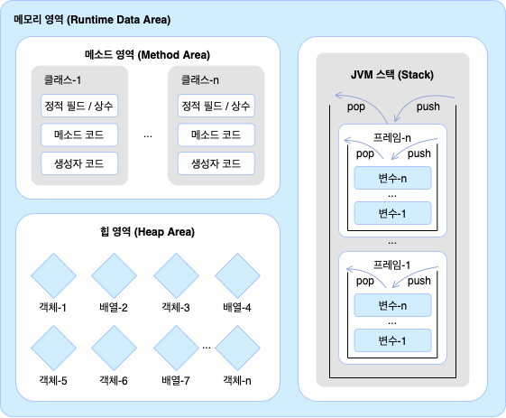
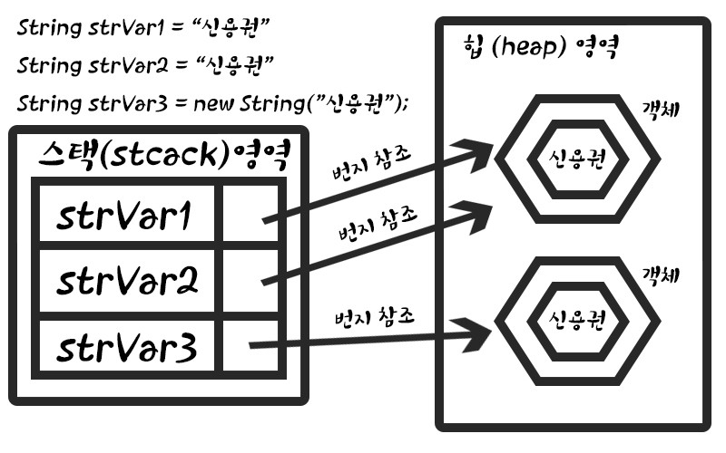

# 메모리 사용 영역


메소드 영역
> 메소드 영역은 JVM이 시작할 때 생성되고 모든 스레드가 공유하는 영역이다.

힙(Heap) 영역
> 객체와 배열이 생성되는 영역이다.  
> JVM 스택 영역의 변수나 다른 객체의 필드에서 참조한다.  
> 만약 참조하는 변수나 필드가 없다면 쓰레기로 취급하고 힙 영역에서 자동으로 제거한다.

JVM 스택 영역
> 각 스레드마다 하나씩 존재하며 스레드가 시작할 때 할당된다.  
자바 프로그램에서 스레드를 생성하지 않았다면 main 스레드만 존재하므로 JVM 스택도 하나이다.   


# 문자열



    strVar1과 strVar2는 같은 문자열을 참조한다.
    이때, 다른 참조를 하고 싶다면 new를 사용해주면 된다.

```java
if(strVar1 == strVar2) //참조가 같은지 검사한다.
strVar1.equals(strvar2) // 두 문자열을 비교한다.
```