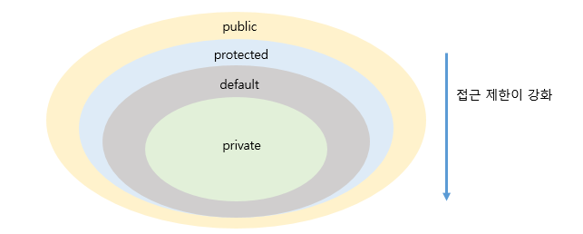

# 상속

## 클래스 상속
- 자식 클래스를 선언할 때 어떤 부모 클래스를 상속받을 것인지를 결정한다.
- 자바는 다중 상속을 허용하지 않는다.

<br></br>
## 부모 생성자 호출
```java
DmbCellPhone dmbCellPhone = new DmbCellPhone();
```
- 아래 코드는 DmbCellPhone 객체만 생성하는 것처럼 보이지만, 사실은 내부적으로 Heap 영역에 부모인 Cellphone 객체가 먼저 생성되고, DmbCellPhone 객체가 생성된다.


*모든 객체는 클래스의 생성자를 호출행만 생성된다. 그렇다면 부모 객체를 생성하는 부모 생성자는 어디서 호출된 것일까?*  

-> `super`는부모의 기본 생성자를 호출한다. 즉, Cellphone클래스의 다음 생성자를 호출한다.
```java
public CellPhone() {

}
```

- Cellphone.java 코드에도 CellPhone의 생성자가 선언되지 않았지만, 컴파일러에 의해 기본 생성자가 만들어지므로 문제없이 실행된다. 만약, 명시적으로 부모 생성자를 호출하고 싶다면 아래와 같이 작성하면 된다.

```java
자식클래스(매개변수선언, ...) {
    super(매개값, ...);
}
```

```java
public class People {
    public String name;
    public String ssn;

    public People(String name, String ssn){
        this.name = name;
        this.ssn = ssn;
    }
}
```

- 이 같은 경우에 People 클래스는 기본 생성자가 없고 name, ssn을 매개값으로 받아 객체를 생성시키는 생성자만 있다. 
- People을 상속하는 Student 클래스는 생성자에서 `super(name, ssn)` 으로 호출해야 한다.

```java
public class Student extends People{
    public int studentNo;

    public Student(String name, String ssn, int studentNo){
        super(name, ssn);
        this.studentNo = studentNo;
    }
}
```

## 메소드 재정의
- 어떤 메소드는 자식 클래스가 사용하기에 적합하지 않을 수도 있다. 이 경우 상속된 일부 메소드는 자식 클래스에서 다시 수정해서 사용해야 한다. 이를 `오버라이딩(Overriding)`이라고 한다.

### @Override
- 메소드 오버라이딩은 상속된 메소드의 내용이 자식 클래스에 맞지 않을 경우, 자식 클래스에서 동일한 메소드를 재정의하는 것을 의미한다.
- 자식 객체에서 오버라이딩하면 부모 객체의 메소드는 숨겨진다.
<br></br>

규칙에 주의  

    부모의 메소드와 동일한 시그니처(리턴 타입, 이름, 매개변수 리스트)를 가져야 한다.  
    접근 제한을 더 강하게 오버라이딩할 수 없다.  
    새로운 예외를 throws할 수 없다.

<br></br>

### 부모 메소드 호출(super)
- 자식 클래스에서 부모 클래스의 메소드를 오버라이딩 하면, 부모 클래스의 메소드는 숨겨지고 오버라이딩된 자식 메소드만 사용된다.
- 그러나, 자식 클래스 내부에서 오버라이딩된 부모 클래스의 메소드를 호출해야 하는 상황이 발생한다면 명시적으로 `super`을 붙여 부모 메소드를 호출할 수 있다.
 
 ### final 클래스와 final 메소드
 - final 키워드는 클래스, 필드, 메소드 선언 시에 사용할 수 있다.
 - final은 클래스, 필드, 메소드 선언에 사용될 경우 해석이 달라진다.

 ### 상속할 수 없는 final 클래스
 - 클래스를 선언할 때 final 키워드를 class 앞에 붙이게 되면 이 클래스는 최종적인 클래스이므로 *상속할 수 없는 클래스*가 된다. 
 - 자식 클래스를 만들 수 없다는 것이다.

 ### 오버라이딩 할 수 없는 final 메소드
 - 메소드의 final을 붙이면 이 메소드는 최종적인 메소드이므로 Overriding 할 수 없는 메소드가 된다.
 - 즉, 자식 클래스가 상속해서 메소드를 재정의할 수 없다는 것이다.

<br></br>

## protected 접근 제한자
- 접근 제한자 중 `protected`는 상속과 관련이 있다.


- protected는 같은 패키지에서는 default와 같이 접근 제한이 없지만, 다른 패키지에서는 자식 클래스만 접근을 허용한다.