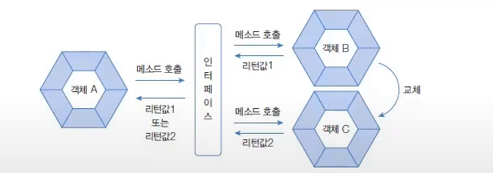
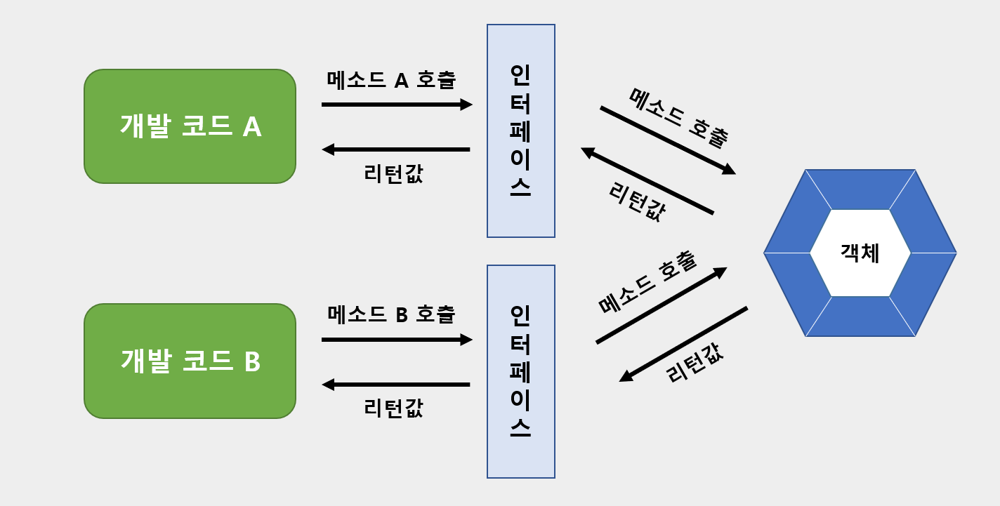

# 인터페이스

- 인터페이스는 개발 코드와 객체가 서로 통신하는 접점 역할을 한다.
- 개발 코드가 인터페이스의 메소드를 호출하면 인터페이스는 객체의 메소드를 호출시킨다.
- 개발 코드는 인터페이스의 메소드만 알고 있으면 된다.



## 인터페이스 선언
- 인터페이스 선언은 class 키워드 대신에 interface 키워드를 사용한다.

```java
public interface RemoteControl {}
```
####  상수 필드
- 인터페이스는 데이터를 저장할 수 있는 필드를 선언할 수 없다. 그러나, 상수 필드는 선언이 가능하다.
- 상수는 인터페이스에  고정된 값으로 런타임 시에 데이터를 바꿀 수 없다. 
- 상수를 선언할 때에는 반드시 초기값을 대입

#### 추상 메소드
- 객체가 가지고 있는 메소드를 설명한 것

#### 디폴드 메소드
- 인터페이스에 선언되지만 사실은 개체가 가지고 있는 인스턴스 메소드라고 생각해야 한다.

#### 정적 메소드
- 객체가 없어도 인터페이스만으로 호출이 가능하다.

---

## 구현 클래스
- 인터페이스의 추상 메소드들에 대한 실체 메소드를 작성할 때, 인터페이스의 모든 메소드는 public 접근 제한을 갖기 때문에 public보다 더 낮은 접근 제한으로 작성할 수 없다.  

- 인터페이스로 구현 객체를 사용하려면 인터페이스 변수를 선언하고, 구현 객체를 대입해야 한다. 인터페이스 변수는 참조 타입이기 때문에 구현 객체가 대입될 경우 구현 객체의 번지를 저장한다.

```java
public class RemoteControlExample{
    public static void main(String[] agrs){
        Remotecontrol rc;    //인터페이스 변수
        rc = new Television(); //변수 = 구현객체
    }
}
```

### 익명 구현 객체
```java
public class RemoteControlExample{
    public static void main(String args[]){
        Remote Control rc = new RemoteControl(){
            public void turnOn() {/*실행문*/}
            public void turnOff() {/*실행문*/}
            public void setVolume(int volume) {/*실행문*/}
        }
    }
}
```

### 다중 인터페이스 구현 클래스

- 인터페이스 A, B가 객체의 메소드를 호출할 수 있으려면 객체는 이 두 인터페이스를 모두 구현해야 한다.
> public class 구현클래스명 implements 인터페이스A, 인터페이스B

### 인터페이스 상속
- 인터페이스도 다른 인터페이스를 상속할 수 있다.
- 다중 상속을 허용한다.

- 하위 인터페이스를 구현하는 클래스는 상위 인터페이스의 모든 추상 메소드의 대한 실체 메소드를 가지고 있어야 한다. 
- 구현 클래스로부터 객체를 생성하고 나서 다음과 같이 하위 및 상위 인터페이스 타입으로 변환이 가능하다.

```
하위 인터페이스 변수 = new 구현클래스();
상위인터페이스1 변수 = new 구현클래스();
상위인터페이스2 변수 = new 구현클래스();
```

*만약 인터페이스 C가 인터페이스 A, B를 상속받는다면?*

- interafceC 인터페이스 변수는 methodA(), methodB(), methodC()를 모두 호출할 수 있지만, interfaceA, interafceB 변수는 각각 methodA()와 methodB() 변수만 호출할 수 있다.

### 디폴트 메소드와 인터페이스 확장
- 디폴트 메소드는 인터페이스에 선언된 인스턴스 메소드이기 때문에 구현 객체가 있어야 사용할 수 있다.
- 디폴트 메소드는 추상 메소드가 아니기 때문에 구현 클래스에서 실체 메소드를 작성할 필요가 없다.

*부모 인터페이스에 디폴트 메소드가 정의도어 있을 경우, 자식 인터페이스에서 디폴트 메소드를 활용하는 방법*
1. 디폴트 메소드를 단순히 상속만 받는다.
2. 디폴트 메소드를 재정의(Override)해서 실행 내용을 변경한다.
3. 디폴트 메소드를 추상 메소드로 재선언한다.

<부모 인터페이스>
```java
public interface ParentInterface{
    public void method1();
    public default void method2() {/*실행문*/}
}
```

<1번 경우>
```java
public interface ChildInterface1 extends ParentInterface{
    public void method3();
}
```

```java
ChildInterface ci1 = new ChildInterface(){
    @Override
    public void mtehod1() {/*실행문*/}
    @Override
    public void method3() {/*실행문*/}
};

ci1.method1();
ci1.method2();  //ParentInterface의 method2() 호출
ci1.method3();
```

<2번 경우>
```java
public interface ChildInterface2 extends ParentInterface{
    @Override
    public default void method2() {/*실행문*/}

    public void method3();
}
```

```java
ChildInterface ci2 = new childInterface(){
    @Override
    public void mtehod1() {/*실행문*/}
    @Override
    public void method3() {/*실행문*/}
};

ci2.method1();
ci2.method2();  //ParentInterface의 method2() 호출
ci2.method3();
```
- ChildInterface2 인터페이스를 구현하는 클래스는 method1()과 method3()의 실체 메소드를 가지고 있어야 하며, ChildInterface2에서 재정의한 method2()를 호출할 수 있다.

<3번 경우>
```java
public interface ChildInterface3 extends ParentInterface{
    @Override
    public void method2(); //추상 메소드로 재선언
    public void method3();
}
```

```java
ChildInterface ci2 = new childInterface(){
    @Override
    public void mtehod1() {/*실행문*/}
    @Override
    public void method2() {/*실행문*/}
    @Override
    public void method3() {/*실행문*/}
};

ci3.method1();
ci3.method2();  //ChildInterface3 구현 객체의 method2() 호출
ci3.method3();
```
- Childinterface3 인터페이스를 구현하는 클래스는 method1()과 method2(), method3()의 실체 메소드를 모두 가지고 있어야 한다.